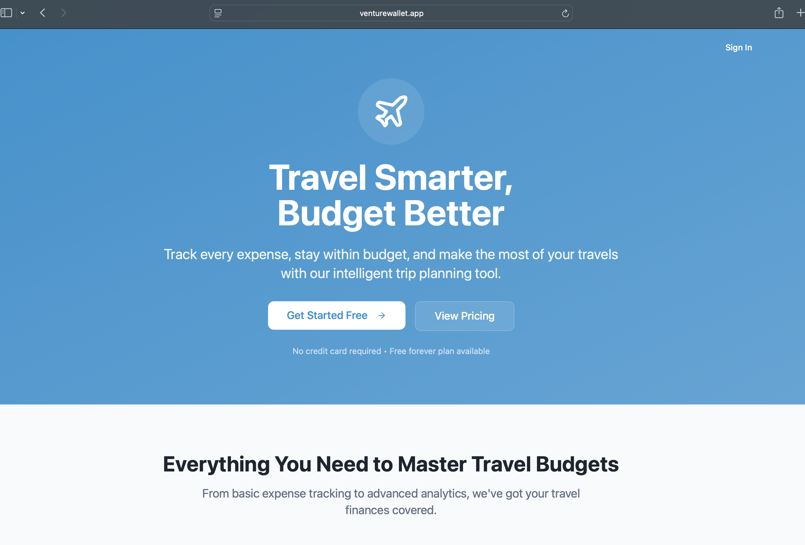
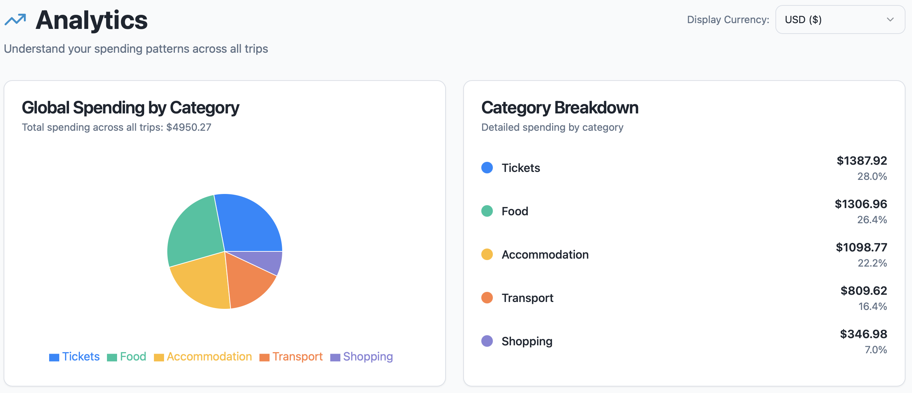
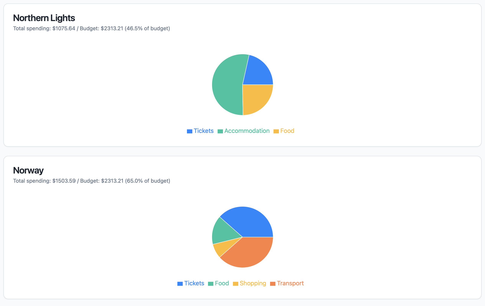

## First app I built

### Introduction

I love travelling and as I started the development journey with AI agents, wondered which application should I get started with. Budgeting during travel has been one of the pain points during my travels and this led me to develop an appication to budget and track expenses. 

[Venture wallet](https://venturewallet.app)

### Features

- Budget allocation
- Expenses categorization 
- Trip sharing
- Analytics

### Tech Stack

- React
- TypeScript
- Supabase
- Vercel

### Launch and Feedback

I launched this app on LinkedIn and Instagram to get feedback from initial users. Some of the suggestions include:

- Split expenses between users
- Automatic expense addition 